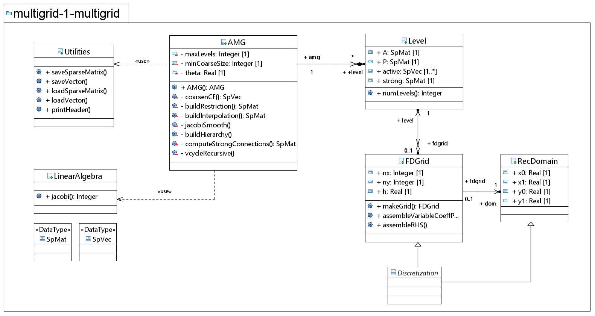
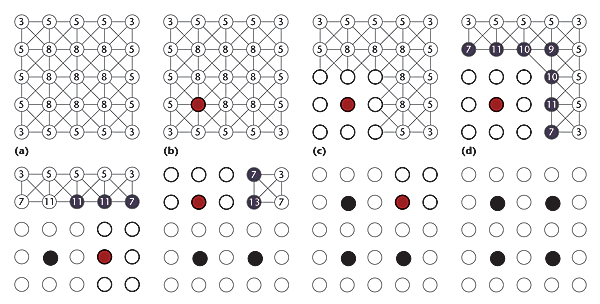
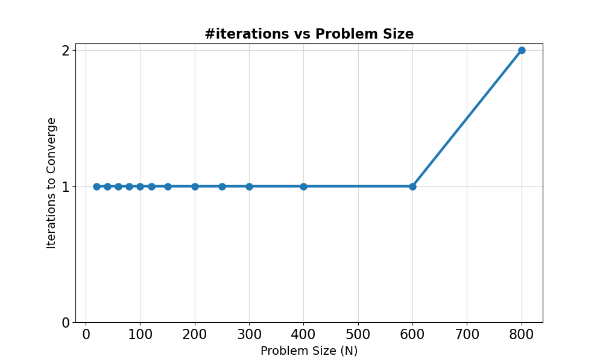
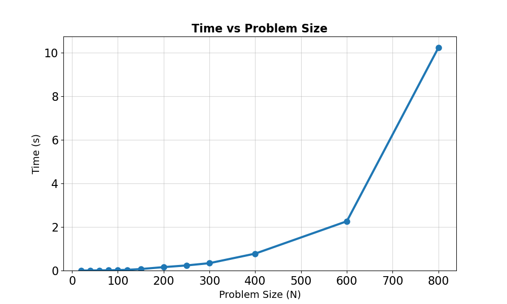

# Algebraic Multigrid (AMG) Solver for Poisson Problems


In this repository you can find a C++ implementation of an **Algebraic Multigrid (AMG)** solver.
The project is aimed at solving large, sparse linear systems arising from the discretization of 1D and 2D Poisson equations with variable coefficients.

## Project Objectives

The implementation successfully addresses the core requirements of the Multigrid project:

1.  **Scalar Version:** full implementation of the AMG hierarchy and V-cycle logic for Cartesian grids using finite differences;
2.  **Parallelization:** sections such as the computing of the Strong connections and the assembly of the metrixes, are optimized using **OpenMP** for multi-core performance;
3.  **Variable Coefficients:** support for non-constant coefficient problems ($-\nabla \cdot a(\mathbf{x}) \nabla u = f$).

## Technical Features

### 1. Hierarchy Construction

Unlike Geometric Multigrid, this solver builds levels by analyzing directly the matrix $A$:

- **Strong Connections:** identifies significant dependencies between variables using the $\theta$ threshold parameter;
- **C/F Splitting:** employs a greedy degree-based heuristic to partition nodes into Coarse (C) and Fine (F) sets;
- **Galerkin Coarse Operator:** automatically generates coarse-level matrices using the triple product $A_c = P^T A P$.

### 2. Solver Algorithm

- **Recursive V-Cycle:** includes pre-smoothing, residual calculation, restriction, coarse-grid correction, and post-smoothing;
- **Smoothers:** apply a few **Jacobi** iterations (found in `jacobi.hpp`);
- **Direct Coarsest Solver:** uses Eigen's `SparseLU` decomposition to solve the system exactly at the lowest level of the hierarchy, where the dimension of the system is small.

## Project Structure

| File                 | Description                                                              |
| :------------------- | :----------------------------------------------------------------------- |
| `AMG.hpp/cpp`        | Core AMG logic: hierarchy building, interpolation ($P$), V-cycle.        |
| `jacobi.hpp`         | Templated Jacobi iterative solvers (Serial & Parallel OpenMP).           |
| `DiscretizeData.hpp` | Finite-difference grid helpers and variable-coefficient matrix assembly. |
| `utilities.hpp`      | I/O utilities for Matrix Market (.mtx) and vector files.                 |
| `example.cpp`        | Tests for 1D and 2D Poisson problems.                                    |
| `main.cpp`           | Command-line interface for solving custom matrices and RHS files.        |



## Software Architecture & Code Mapping

Here is a mapping of the main components to help understand how the mathematical concepts are translated into C++ code:

### 1. Domain Discretization (`DiscretizeData.hpp`)

This component handles the "Physics" of the problem:

- **Grid Management:** `struct FDGrid` and `struct RectDomain` manage the geometry;
- **Variable Coefficients:** `assemble_poisson_matrix` loops through the 2D grid and applies the function $a(x,y)$ to each stencil point.

This module is going to give us a matrix from the input Poisson problem, and the corresponding RHS vector given the forcing term $f$. It does it by using the finite-difference method.

### 2. The Multigrid Hierarchy (`AMG.hpp` & `AMG.cpp`)

The solver's core is the `class AMG`, which manages the multilevel structure through the `struct Level`.

- **Hierarchy Building:** `AMG::buildHierarchy` function, in `AMG.cpp`, orchestrates the creation of coarse levels until the system is small enough to be solved directly;
- **Strong Connections:** `AMG::computeStrongConnections` implements the logic to identify which variables are heavily dependent on each other using the $\theta$ threshold;
- **C/F Splitting:** the greedy coarsening algorithm is located in `AMG::coarsenCF`, which partitions nodes into Fine and Coarse sets.



_Image credit: "An Introduction to Algebraic Multigrid"._

### 3. Transfer Operators & Galerkin Implementation

- **Interpolation ($P$):** matrix $P$ is constructed in `AMG::buildInterpolation` using the splitting results;
- **Restriction ($R$):** matrix $R$ is implemented in `AMG::buildRestriction` as the transpose of $P$ ($R = P^T$), ensuring a symmetric Galerkin approach;
- **Coarse Matrix ($A_c$):** in `buildHierarchy`, the coarse operator is computed via the triple product `L.R * L.A * L.P`. This ensures that the solver is naturally able to adapt to variable coefficients $a(x,y)$ by preserving the operator properties across the hierarchy.

### 4. The V-Cycle

The recursive solver logic is contained in `AMG::vcycleRecursive`:

1.  **Pre-smoothing:** calls `jacobiSmooth`, which delegates to `LinearAlgebra::Jacobi` (in `jacobi.hpp`);
2.  **Residual & Restriction:** calculates $r = b - Ax$ and projects it to the lower level;
3.  **Coarsest Solve:** when the base level is reached, it uses `Eigen::SparseLU` for an exact solution of the error equation $A e = r$;
4.  **Prolongation & Correction:** the coarse error is interpolated back and added to the fine solution;
5.  **Post-smoothing:** a final Jacobi smoothing, to ensure the simmetry with the pre-smoothing.

<!-- ### 4. Parallel Acceleration `jacobi.hpp`

Parallelism, which is **Point 2** of the project, is implemented in the `LinearAlgebra::JacobiParallel` function. It uses **OpenMP** directives (`#pragma omp parallel for`) to distribute the computation of the solution vector across multiple CPU cores, which leads to significant acceleration of the smoothing phase on large grids. -->

### 5. Convergence Results

The `tests/convergence_test.cpp` file runs a series of experiments to evaluate how the number of iterations required for convergence scales with problem size. What we wanted to show is that AMG is scalable, i.e. the number of iterations is $O(1)$ with respect to the problem size.

|                                            |                                     |
| ------------------------------------------ | ----------------------------------- |
|  |  |

## Employed technologies


## Compilation and execution

First of all clone the repository through

```bash
$ git clone https://github.com/AMSC-25-26/multigrid-1-multigrid.git
```

or better via SSH

```bash
$ git clone git@github.com:AMSC-25-26/multigrid-1-multigrid.git
```

Load the `amsc_mk_2025.sif` container.

Move to the folder `multigrid-1-multigrid` and run the following commands

```bash
$ mkdir build
$ cd build
$ cmake ..
$ make
```

The executable for the project will be created into the `multigrid-1-multigrid/build` folder, and can be lanched through

```bash
$ ./main  <matrix_file> [rhs_option] [max_levels] [min_coarse_size] [theta]
```

Moreover, an executable for showcasing the features of the project is emitted by the compiling process and can be recalled using

```bash
$ ./example
```

For the convergence tests instead:

```bash
$ ./convergence_test
```
